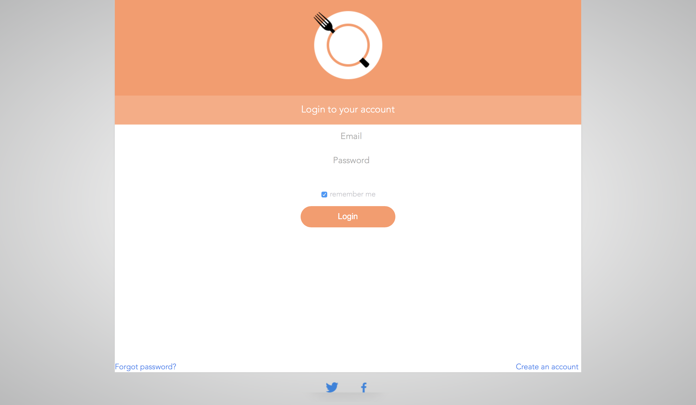

#  EATAPP 
  A website that ranks meals from restaurants in your area by price, ratings and distance

## Features

  - Latest stable version after database change. Distance functions removed to make the search work.
  - Added OCR (optical character recognition) to the admin panel for Menus parsing
  - Import/export menus un XML format
  - Rotating icon when searching (pizza)
  - New final database changes added
  - New login and sign up designs

## Screenshots

    

## Database

       

## Contributors
  :bowtie: Michel Balamou
