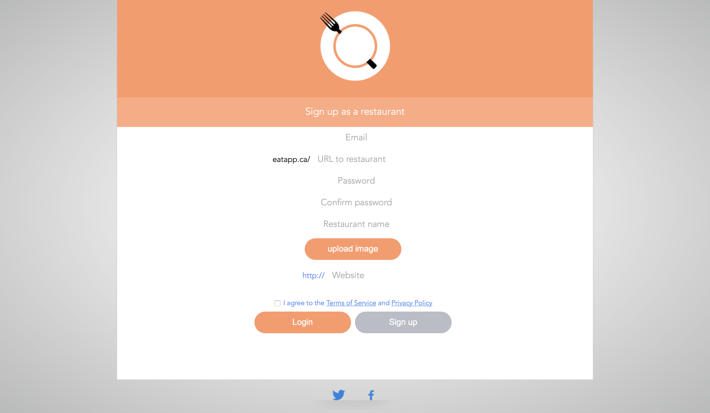

#  EATAPP
  A website that ranks meals from restaurants in your area by price, ratings and distance

## Features

  - Latest version

  <iframe src='https://gfycat.com/ifr/PlaintiveUnkemptBlackrussianterrier' frameborder='0' scrolling='no' allowfullscreen width='640' height='370'></iframe>

  
<iframe src='https://gfycat.com/ifr/PlaintiveUnkemptBlackrussianterrier' frameborder='0' scrolling='no' width='100%' height='100%' style='position:absolute;top:0;left:0' allowfullscreen></iframe>

  

  

## Screenshots

    

## Database

       

## Languages

  - HTML/CSS
  - Javascript and JQuery for the client side
  - PHP for the server side
  - MySQL for the database

## Contributors
  :bowtie: Michel Balamou
